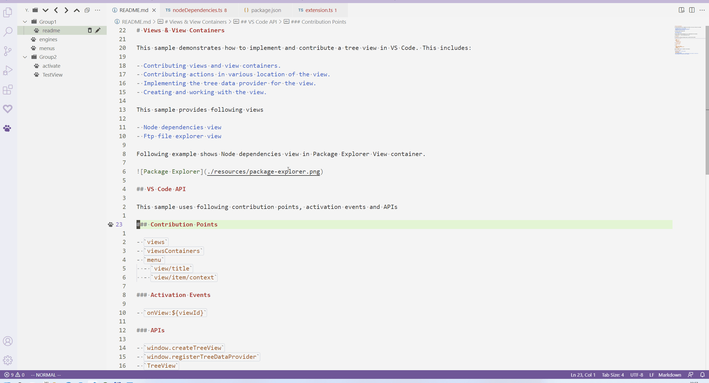
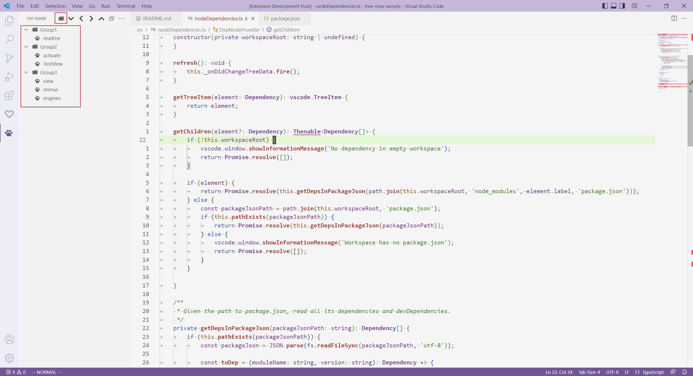
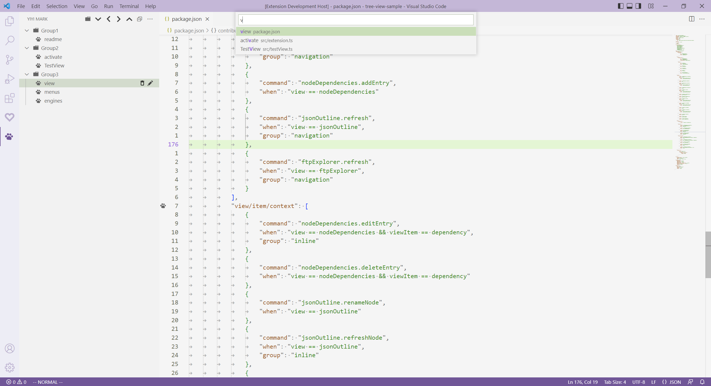
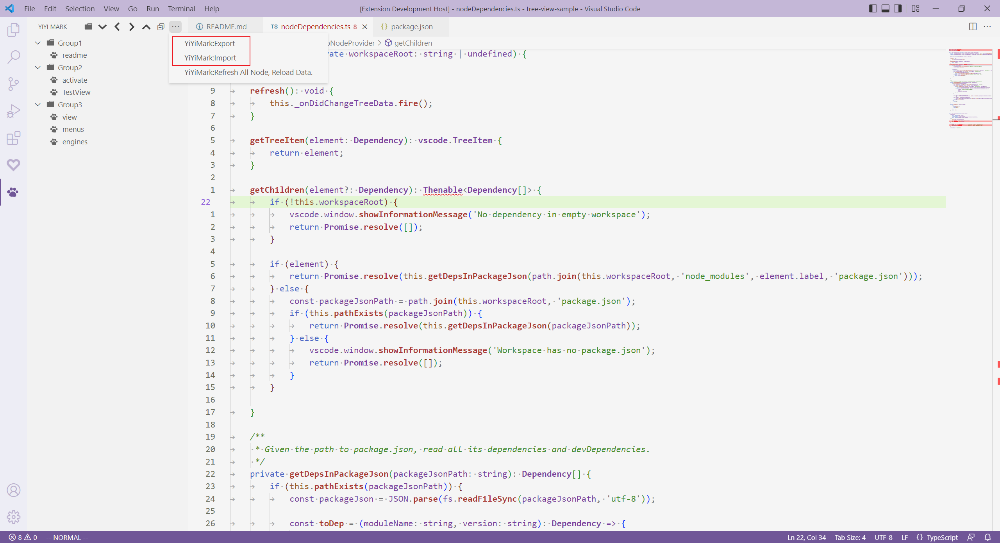
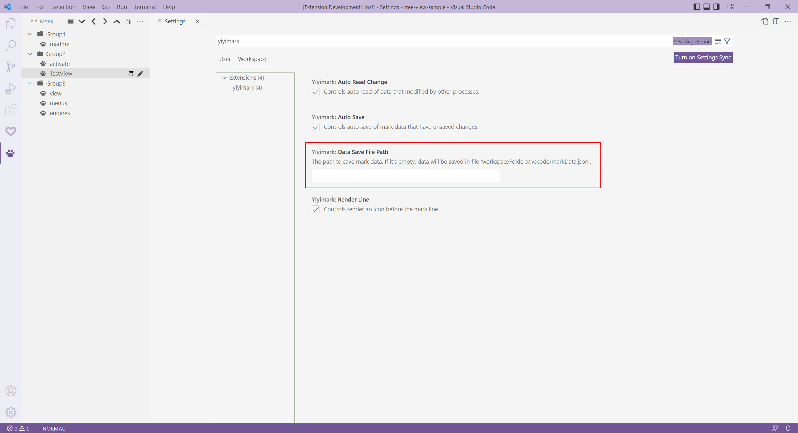

# YiYiMark
Bookmark for Vs Code

## 使用方法
在代码文件中，打开右键菜单，选择Mark Current Line，即可创建一个书签节点。
左侧选择YiYiMark的TreeView（猫爪图标），有更多操作。

## 提供的功能：
* 标记代码行，保存到书签节点
* 书签节点分组，类似于文件系统的组织方式
* 拖拽移动书签节点 (VsCode version > 1.64)
* 模糊搜索
* 导入导出
* 书签以Json文件的形式保存
* 可以设置书签文件目录，让多个工程共享同一个书签文件

## 不支持的功能：
* 不支持单个VsCode实例打开多个工程的场景

## Features

* 分组(Group)

* 模糊搜索(Fuzzy search)
YiYiMark:Search

* 书签导入导出(import and export)

* 不同工程（文件夹）共享同一个书签文件(Multiple projects sharing the same mark data)

## 其他

在某些特殊场景下，工程路径可能无法正确获取，这时可以在插件的WorkSpace配置中手动指定一个路径。